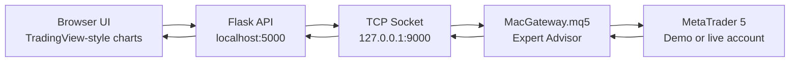
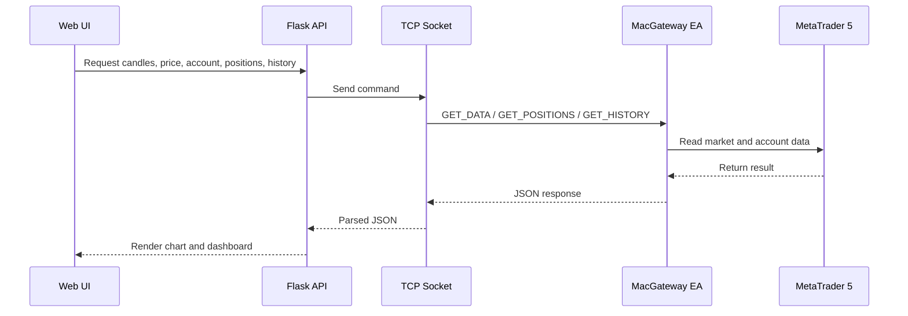
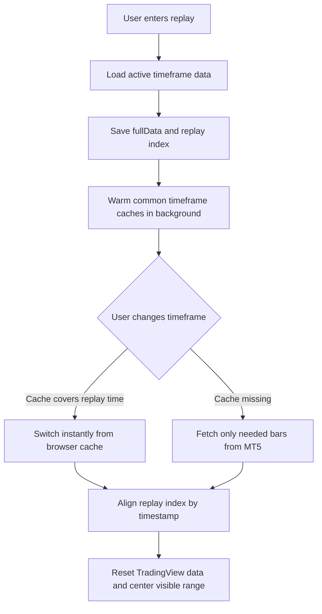

# MT5 TradingView Backtester

Manual backtesting, bar replay, and MT5 trade control in a TradingView-style web app.

This project connects a Flask web app to MetaTrader 5 through a local TCP socket bridge. It is designed for traders who want a fast TradingView-like interface while still using an MT5 demo or live account.

[](https://www.python.org/)
[](https://flask.palletsprojects.com/)
[](https://www.metatrader5.com/)
[](./LICENSE)

## Why This Project Exists

MetaTrader 5 is powerful for execution, but its Python package is hard to use on macOS. This project avoids that problem by using a small MQL5 Expert Advisor as a socket client. The browser UI talks to Flask, Flask talks to MT5, and MT5 sends back candles, prices, positions, account data, and deal history.



## Highlights

- TradingView-style chart workspace with 1, 2, and 4 chart layouts.
- Bar replay with play, pause, step forward, keyboard shortcuts, jump-to-date, and speed control.
- Frontend history cache for faster replay timeframe switching.
- Live MT5 account panel with balance, equity, margin, open positions, and recent deal history.
- Market buy/sell execution from the web UI through MT5.
- Virtual backtest mode with simulated positions, pending orders, SL/TP, and history.
- Custom chart time formatting with full date and time display.
- Lightweight stack: Flask, vanilla JavaScript, CSS, and MQL5 sockets.

## Visual Overview

### Data And Trading Flow



### Replay Cache Flow



## Repository Layout

```text
.
├── app.py                    # Flask routes and API endpoints
├── mt5_data.py               # Thread-safe TCP socket server for MT5
├── MacGateway.mq5            # MT5 Expert Advisor socket client
├── Start-Windows.bat         # Double-click launcher for Windows
├── Start-macOS.command       # Double-click launcher for macOS
├── scripts/                  # Launcher helper scripts
├── templates/index.html      # Main app layout
├── static/css/style.css      # App styling and responsive layout
├── static/js/datafeed.js     # TradingView datafeed and history cache
├── static/js/chart.js        # Chart panels, trade manager, live dashboard
├── static/js/playbook.js     # Trading playbook, journal, strategy library
├── static/js/replay.js       # Bar replay engine
└── static/charting_library/  # Local TradingView Advanced Charts files
```

## Important Note About TradingView Advanced Charts

This repository does not vendor `static/charting_library/`.

TradingView Advanced Charts is not the same as the open-source Lightweight Charts package. It requires access from TradingView and may have redistribution limits. To run this project locally, place your licensed Charting Library files in:

```text
static/charting_library/
```

The app expects this file to exist:

```text
static/charting_library/charting_library.standalone.js
```

## Requirements

- Python 3.8 or newer
- MetaTrader 5
- A demo or live MT5 account
- TradingView Advanced Charts files
- Flask

Install Python dependencies:

```bash
pip install -r requirements.txt
```

## Setup

### Quick Start By Operating System

Windows:

```text
Double-click Start-Windows.bat
```

macOS:

```text
Double-click Start-macOS.command
```

Both launchers create a local `.venv`, install dependencies, start Flask, and open the app in your browser.

### 1. Install The MT5 Expert Advisor

1. Open MetaTrader 5.
2. Click `File > Open Data Folder`.
3. Open `MQL5/Experts/`.
4. Copy `MacGateway.mq5` into that folder.
5. In MT5 Navigator, right-click `Expert Advisors` and choose `Refresh`.
6. Drag `MacGateway` onto any chart.
7. Enable `Allow Algo Trading`.
8. Turn on the MT5 `Algo Trading` button.

### 2. Start The Web App

```bash
python app.py
```

Then open:

```text
http://localhost:5000
```

You should see the MT5 status change to connected when the EA connects to the local socket server.

## One-Click Launchers

### Windows Version

Run:

```text
Start-Windows.bat
```

The launcher will:

- create a local `.venv` folder if it does not exist;
- install Python dependencies from `requirements.txt`;
- start the Flask web server;
- open `http://127.0.0.1:5000` in your default browser.

Keep the launcher window open while using the app. To stop the server, click the red power button inside the web app or press `Ctrl+C` in the launcher window.

Windows notes:

- Install Python 3.8+ first and enable `Add Python to PATH`.
- Place your licensed TradingView Charting Library files in `static/charting_library/`.
- In MT5, copy `MacGateway.mq5` into `MQL5/Experts/`, refresh Expert Advisors, attach it to a chart, and enable Algo Trading.
- If Windows Firewall asks for permission, allow the local Python app on private networks.

### macOS Version

Run:

```text
Start-macOS.command
```

If macOS blocks the file the first time, right-click it, choose `Open`, then confirm.

macOS notes:

- Install Python 3.8+ first if `python3` is not available.
- Place your licensed TradingView Charting Library files in `static/charting_library/`.
- In MT5, copy `MacGateway.mq5` into `MQL5/Experts/`, refresh Expert Advisors, attach it to a chart, and enable Algo Trading.
- Keep the Terminal window open while using the app.

## Socket Commands

The Flask backend and MT5 EA communicate with newline-terminated text commands:

| Command | Purpose |
| --- | --- |
| `GET_SYMBOLS` | List Market Watch symbols |
| `GET_PRICE;<symbol>` | Get bid and ask |
| `GET_DATA;<symbol>;<timeframe>;<bars>` | Get OHLCV candles |
| `TRADE_BUY;<symbol>;<lots>;<sl>;<tp>` | Place market buy |
| `TRADE_SELL;<symbol>;<lots>;<sl>;<tp>` | Place market sell |
| `TRADE_CLOSE;<ticket>` | Close an open position |
| `GET_POSITIONS` | Get open positions |
| `GET_HISTORY;<days>` | Get recent MT5 deal history |
| `GET_ACCOUNT` | Get account summary |

## API Endpoints

| Endpoint | Method | Description |
| --- | --- | --- |
| `/api/status` | `GET` | MT5 connection status |
| `/api/symbols` | `GET` | Available symbols |
| `/api/data` | `POST` | Historical candles |
| `/api/price/<symbol>` | `GET` | Current bid and ask |
| `/api/trade/place` | `POST` | Place a live MT5 order |
| `/api/trade/close` | `POST` | Close a live MT5 position |
| `/api/trade/positions` | `GET` | Open MT5 positions |
| `/api/trade/history?days=30` | `GET` | Recent MT5 deals |
| `/api/trade/account` | `GET` | Account balance and margin data |

## Development Notes

- Keep all MT5 socket calls inside `MT5DataFetcher._send_request(...)` so requests stay thread-safe.
- Do not edit the TradingView library bundle directly. Use widget options, datafeed logic, CSS, and app code.
- Replay mode depends on timestamp alignment. Update `replayManager.fullData` and `replayManager.currentIndex` before forcing chart data reloads.
- The live history tab reads MT5 deal history. A newly opened live position appears as `Opened`; closed deals appear as `Profit`, `Loss`, or `Closed`.

## Troubleshooting

### MT5 status stays disconnected

- Make sure `python app.py` is running.
- Make sure `MacGateway.mq5` is attached to an MT5 chart.
- Make sure Algo Trading is enabled.
- Check that the EA uses `127.0.0.1` and port `9000`.

### The chart does not load

- Check that `static/charting_library/charting_library.standalone.js` exists.
- Check the Flask terminal for `/api/data` errors.
- Make sure MT5 has the symbol selected in Market Watch.

### Live trade history is empty

- The history tab reads MT5 deals from the last 30 days.
- Open deals should appear as `Opened`.
- Closed deals should appear as `Profit`, `Loss`, or `Closed`.
- If MT5 history is filtered or empty, open the MT5 Toolbox History tab and make sure recent deals are available.

## Roadmap

- Pending order support for live MT5 mode.
- Export backtest results to CSV.
- Strategy notes and session tagging.
- Saved workspaces and chart templates.
- Docker-friendly backend mode for Windows/Linux.

## License

This project is released under the MIT License. See [LICENSE](./LICENSE).
