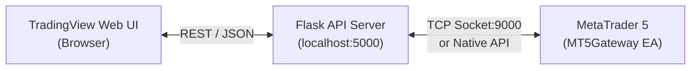

# MT5 TradingView Backtester

[](https://www.python.org/)
[](https://flask.palletsprojects.com/)
[](https://www.metatrader5.com/)
[](#)
[](./LICENSE)

A high-performance, **1:1 TradingView Web UI** manual backtesting and bar replay application powered by **MetaTrader 5 (MT5)**. Supports both **Windows 10/11** and **macOS (Apple Silicon & Intel)**.

> 📖 **Xem hướng dẫn chi tiết tiếng Việt tại: [INSTRUCTIONS.md](./INSTRUCTIONS.md)**

---

## ✨ Key Features

- **Pixel-Perfect TradingView Web Interface**:
  - **Top Header Bar**: Symbol Pill with exchange/timeframe (`EURUSD · MT5 · H1`), standard timeframe buttons (`1m, 5m, 15m, 30m, 1h, 4h, D, W ▼`), Indicators (`fx`), Bar Replay (`⏪`), Multi-chart Layout (`⊞`), Quick Search (`🔍`), Fullscreen (`⛶`), Snapshot (`📷`), and Safe Server Shutdown (`⏻`).
  - **Quick Trading Widget**: Draggable, minimizable overlay widget on the chart canvas displaying live Bid/Ask prices with 1-click Market BUY/SELL execution and volume lots sync.
  - **Right Dock (45px) & Order Ticket Drawer**: Slide-in order ticket panel with Market/Pending execution, Stop Loss & Take Profit in Price, Pips, or Risk USD ($), and real-time R:R (Risk/Reward) calculator.
  - **Bottom Dashboard (TradingView 2-Tier)**: Top strip for Account Summary (Balance, Equity, Margin, Free Margin) with collapsible chevron; Middle data grid for open Positions, Orders, and History; Bottom status bar with Time Ranges (`1D` to `ALL`), Price Scale toggles (`%`, `log`, `auto`), and real-time live clock (`UTC+7`).
- **Cross-Platform Compatibility**:
  - **macOS**: Native MQL5 TCP Socket Gateway (`MT5Gateway.mq5` / `MacGateway.mq5`) on port 9000, avoiding Wine Python limitations.
  - **Windows**: Dual connection support — works with both the Socket Gateway EA and the official `MetaTrader5` Python package.
  - **1-Click Launchers**: Double-click `Start-macOS.command` on Mac or `Start-Windows.bat` on Windows.
- **Ultra-Fast Timeframe Switching**: Smart memory cache with local chunked storage ensures switching timeframes takes milliseconds without chart freezing.
- **Bar Replay Engine**: Jump to any historical bar, variable replay speeds (0.1s - 2.0s), step-by-step forward, date-time jumping, and spacebar play/pause.
- **Offline History Storage**: Download candles in chunks for fully offline backtesting without needing active MT5 or internet connection.

---

## 🏗️ Architecture Overview


```mermaid
flowchart LR
    Browser["TradingView Web UI<br/>(Browser)"] <-->|REST / JSON| Flask["Flask API Server<br/>(localhost:5000)"]
    Flask <-->|TCP Socket:9000<br/>or Native API| MT5["MetaTrader 5<br/>(MT5Gateway EA)"]
```

---

## 📁 Repository Layout

```text
.
├── app.py                    # Flask server with dynamic port detection & REST APIs
├── mt5_data.py               # Cross-platform MT5 data fetcher (Socket Gateway & Native API)
├── history_store.py          # Chunked local history database & memory caching
├── MT5Gateway.mq5            # Universal MT5 Expert Advisor socket gateway (Windows & macOS)
├── MacGateway.mq5            # Legacy socket gateway (compatible alias)
├── Start-Windows.bat         # 1-Click launcher for Windows
├── Start-macOS.command       # 1-Click launcher for macOS
├── scripts/
│   ├── windows_start.ps1     # PowerShell launcher helper
│   └── macos_start.sh        # Bash launcher helper
├── templates/index.html      # TradingView Web 1:1 interface template
├── static/
│   ├── css/style.css         # TradingView dark theme styling & responsive layouts
│   ├── js/chart.js           # Chart manager, draggable widget, order ticket, bottom dashboard
│   ├── js/datafeed.js        # TradingView custom datafeed & real-time sync
│   ├── js/replay.js          # Bar replay controller
│   ├── js/playbook.js        # Trading journal and playbook
│   └── charting_library/     # TradingView Advanced Charts library files
├── INSTRUCTIONS.md           # Comprehensive user manual (Tiếng Việt)
└── requirements.txt          # Python dependencies
```

---

## 🚀 Quick Start

### 1. macOS
1. Double-click `Start-macOS.command`.
2. The launcher will create `.venv`, install requirements, and open `http://localhost:5000` (or `5001`).
3. In MT5: Copy `MT5Gateway.mq5` to `MQL5/Experts/`, allow WebRequest for `http://127.0.0.1`, and drag it onto any chart.

### 2. Windows
1. Double-click `Start-Windows.bat`.
2. The launcher will run via PowerShell, configure Python, and launch the browser.
3. In MT5: Copy `MT5Gateway.mq5` to `MQL5/Experts/`, allow WebRequest for `http://127.0.0.1`, and drag it onto any chart.
   *(Optional: run `pip install MetaTrader5` to connect directly without EA).*

---

## 📖 Detailed Instructions

For complete step-by-step setup guides, MT5 configuration, feature walk-throughs, and troubleshooting, please read:
👉 **[INSTRUCTIONS.md](./INSTRUCTIONS.md)**

---

## 📜 License

This project is licensed under the MIT License - see the [LICENSE](./LICENSE) file for details.
