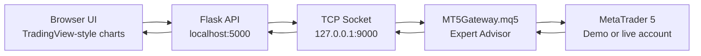
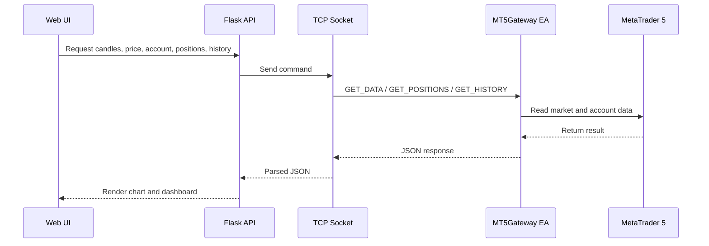
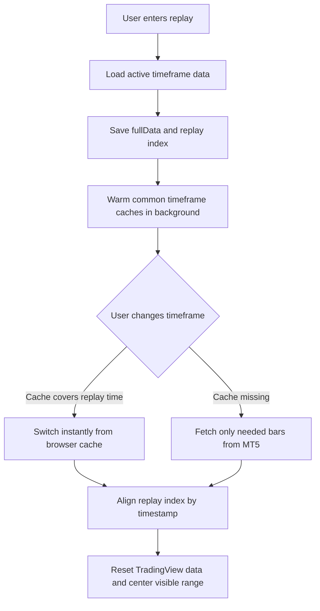

# Tham chiếu Flask / MT5 cũ

> Lưu lại README trước khi chuyển trang chính sang PATH-2 (01/10/2026).
> Các nhãn "supported", launcher, setup và roadmap bên dưới mô tả runtime legacy;
> không phải hướng phát triển hoặc mức nghiệm thu hiện tại.
> Bắt đầu từ [README chính](../README.md) cho `foundation_v2`.
> Các đường dẫn trong code block tính từ thư mục gốc repository.

---

# MT5 TradingView Backtester

Manual backtesting, bar replay, and guarded MT5 demo trade control in a TradingView-style web app.

The supported daily entrypoint is `workspace_app.py`. It combines Evidence, Research, Practice & Journal, Demo Trade Desk, and read-only live readiness in one local Flask workspace. The older `app.py` UI remains for legacy replay compatibility, but the launchers no longer use it.

This project connects a Flask web app to MetaTrader 5 through a local TCP socket bridge. It is designed for traders who want a fast TradingView-like interface while still using an MT5 demo or live account.

[](https://www.python.org/)
[](https://flask.palletsprojects.com/)
[](https://www.metatrader5.com/)
[](../LICENSE)

## Why This Project Exists

MetaTrader 5 is powerful for execution, but its Python package is hard to use on macOS. This project avoids that problem by using a small MQL5 Expert Advisor as a socket client. The browser UI talks to Flask, Flask talks to MT5, and MT5 sends back candles, prices, positions, account data, and deal history.



## Highlights

- Focused single-chart TradingView-style workspace, optimized for deliberate replay practice.
- Bar replay with play, pause, step forward, keyboard shortcuts, jump-to-date, and speed control.
- Frontend history cache for faster replay timeframe switching.
- Live MT5 account panel with balance, equity, margin, open positions, and recent deal history.
- Guarded Trade Desk execution is demo-only; legacy direct trade routes are retired and live execution is not exposed.
- Virtual backtest mode with simulated positions, pending orders, SL/TP, and history.
- Trade storytelling: execution markers on chart, per-trade R-multiple tracking.
- Session report on replay exit (equity curve, win rate, profit factor, expectancy, max drawdown), persisted locally in SQLite.
- Analytics tab with equity curve, per-trade statistics, cross-session progress comparison, and saved report review.
- Integrated Evidence analytics uses `metrics-v2` for explicit N/A semantics, closed-trade balance drawdown labeling, one filtered read model, and basis-aware comparison/export.
- Probability / Risk Lab provides clearly labeled hypothetical models plus a gated empirical UTC-day block bootstrap; it does not present either as a forecast.
- CSV trade-ledger and PNG equity-curve export from each session report.
- Bilingual UI (English / Tiếng Việt), including the TradingView chart locale.
- Dark and light themes, applied to both the app and the charts.
- Custom chart time formatting with full date and time display.
- Lightweight stack: Flask, vanilla JavaScript, CSS, and MQL5 sockets.

## Visual Overview

### Data And Trading Flow



### Replay Cache Flow



## Repository Layout

```text
.
├── app.py                    # Flask routes and API endpoints
├── session_store.py           # Validated SQLite persistence for replay-session reports
├── mt5_data.py               # Thread-safe TCP socket server for MT5
├── MT5Gateway.mq5            # MT5 Expert Advisor socket client
├── Start-Windows.bat         # Double-click launcher for Windows
├── Start-macOS.command       # Double-click launcher for macOS
├── scripts/                  # Launcher helper scripts
├── templates/index.html      # App shell (topbar, workspace, drawers, modals)
├── static/css/app.css        # Design system: TradingView-authentic dark + light themes
├── static/js/datafeed.js     # TradingView datafeed and history cache
├── static/js/i18n.js         # Bilingual EN/VI strings (UI + TradingView locale)
├── static/js/charts.js        # Focused chart, trade markers, live polling, replay plumbing
├── static/js/trading.js      # Order panel, virtual account (R-multiple tracking), bottom dashboard
├── static/js/replay.js       # Bar replay engine, keyboard shortcuts, session snapshot
├── static/js/playbook.js     # Playbook drawer: journal, setups, roadmap
├── static/js/analytics.js    # Data storytelling: equity curve, session stats/report, saved sessions
├── static/js/app.js          # Bootstrap, toolbar, settings (language/theme), modals, MT5 status
└── static/charting_library/  # Local TradingView Advanced Charts files
```

## Important Note About TradingView Advanced Charts

This repository does not vendor `static/charting_library/`.

TradingView Advanced Charts is not the same as the open-source Lightweight Charts package. It requires access from TradingView and may have redistribution limits. To run this project locally, place your licensed Charting Library files in:

```text
static/charting_library/
```

The app expects this file to exist:

```text
static/charting_library/charting_library.standalone.js
```

## Requirements

- Python 3.8 or newer
- MetaTrader 5
- A demo or live MT5 account
- TradingView Advanced Charts files
- Flask

Install Python dependencies:

```bash
pip install -r requirements.txt
```

## Setup

### Quick Start By Operating System

Windows:

```text
Double-click Start-Windows.bat
```

macOS:

```text
Double-click Start-macOS.command
```

Both launchers create a local `.venv`, install dependencies, start Flask, and open the app in your browser.

The launchers start `workspace_app.py` on loopback. Demo execution uses the local simulator by default and live execution remains locked behind a separate gate.

### 1. Install The MT5 Expert Advisor

1. Open MetaTrader 5.
2. Click `File > Open Data Folder`.
3. Open `MQL5/Experts/`.
4. Copy `MT5Gateway.mq5` into that folder.
5. In MT5 Navigator, right-click `Expert Advisors` and choose `Refresh`.
6. Drag `MT5Gateway` onto any chart.
7. The gateway is read-only by default for execution. Leave `InpEnableDemoExecution=false` unless you are running an explicitly approved demo-only rehearsal.
8. For an approved demo rehearsal only, set `InpEnableDemoExecution=true` and configure the exact `InpExpectedDemoLogin` and `InpExpectedDemoServer`; the gateway still refuses non-demo accounts.
9. Enable `Allow Algo Trading` / the MT5 `Algo Trading` button only when that approved demo execution scope requires it.

### 2. Start The Web App

```bash
python workspace_app.py
```

Then open:

```text
http://localhost:5000
```

The integrated workspace starts without an MT5 connection. MT5-backed readiness remains opt-in and does not enable live execution.

## One-Click Launchers

### Windows Version

Run:

```text
Start-Windows.bat
```

The launcher will:

- create a local `.venv` folder if it does not exist;
- install Python dependencies from `requirements.txt`;
- start the Flask web server;
- open `http://127.0.0.1:5000` in your default browser.

Keep the launcher window open while using the app. Press `Ctrl+C` in the launcher window to stop it.

Windows notes:

- Install Python 3.8+ first and enable `Add Python to PATH`.
- Place your licensed TradingView Charting Library files in `static/charting_library/`.
- In MT5, copy `MT5Gateway.mq5` into `MQL5/Experts/`, refresh Expert Advisors, attach it to a chart, and enable Algo Trading.
- If Windows Firewall asks for permission, allow the local Python app on private networks.

### macOS Version

Run:

```text
Start-macOS.command
```

If macOS blocks the file the first time, right-click it, choose `Open`, then confirm.

macOS notes:

- Install Python 3.8+ first if `python3` is not available.
- Place your licensed TradingView Charting Library files in `static/charting_library/`.
- In MT5, copy `MT5Gateway.mq5` into `MQL5/Experts/`, refresh Expert Advisors, attach it to a chart, and enable Algo Trading.
- Keep the Terminal window open while using the app.

## Socket Commands

The Flask backend and MT5 EA communicate with newline-terminated text commands:

| Command | Purpose |
| --- | --- |
| `GET_SYMBOLS` | List Market Watch symbols |
| `GET_PRICE;<symbol>` | Get bid and ask |
| `GET_DATA;<symbol>;<timeframe>;<bars>` | Get OHLCV candles |
| `TRADE_BUY;<symbol>;<lots>;<sl>;<tp>;<request_id>` | Demo-only market buy when the EA execution opt-in and exact demo identity guard both pass |
| `TRADE_SELL;<symbol>;<lots>;<sl>;<tp>;<request_id>` | Demo-only market sell when the EA execution opt-in and exact demo identity guard both pass |
| `TRADE_CLOSE;<ticket>;<request_id>` | Demo-only close under the same execution guard |
| `CHECK_ORDER;<side>;<symbol>;<lots>;<sl>;<tp>` | Broker-side validation only; does not send an order |
| `GET_POSITIONS` | Get open positions |
| `GET_HISTORY;<days>` | Get recent MT5 deal history |
| `GET_ACCOUNT` | Get account summary |

## API Endpoints

| Endpoint | Method | Description |
| --- | --- | --- |
| `/api/status` | `GET` | MT5 connection status |
| `/api/symbols` | `GET` | Available symbols |
| `/api/data` | `POST` | Historical candles |
| `/api/price/<symbol>` | `GET` | Current bid and ask |
| `/api/trade/place` | `POST` | Retired legacy write route; returns `410 LEGACY_EXECUTION_DISABLED` |
| `/api/trade/close` | `POST` | Retired legacy write route; returns `410 LEGACY_EXECUTION_DISABLED` |
| `/api/trade/positions` | `GET` | Open MT5 positions |
| `/api/trade/history?days=30` | `GET` | Recent MT5 deals |
| `/api/trade/account` | `GET` | Account balance and margin data |
| `/trade-desk` | `GET` | Guarded demo Trade Desk |
| `/api/execution/state` | `GET` | Demo execution state and durable request journal |
| `/api/execution/preview` | `POST` | Risk preview; no order send |
| `/api/execution/orders` | `POST` | Guarded demo-only order placement through `ExecutionService` |
| `/api/execution/pending-orders` | `POST` | Guarded demo-only pending limit/stop placement |
| `/api/execution/positions/<id>/close` | `POST` | Guarded demo-only close through `ExecutionService` |
| `/api/execution/requests/<request_id>/reconcile` | `POST` | Reconcile an unknown durable request before retrying |
| `/api/execution/kill-switch` | `POST` | Persistently block/unblock new demo orders; close/cancel remain separate confirmed actions |
| `/api/execution/alerts` | `POST` | Register local in-app price/news/disconnect/risk alert rules with expiry support |
| `/api/execution/alerts/<id>/ack` | `POST` | Acknowledge one persisted in-app alert |
| `/api/chart/annotations` | `GET`, `POST` | Versioned time/price annotations with replay-cutoff validation |
| `/api/chart/layouts/<layout_key>` | `GET`, `PUT` | Revisioned workspace chart-layout state |
| `/api/research/runs/<id>/execute` | `POST` | Run one explicitly supported deterministic local research engine |
| `/api/research/runs/<id>/validation` | `GET` | Independent reconciliation of a completed engine artifact |
| `/api/research/runs/<id>/analytics` | `GET` | Reconciled research analytics with explicit blocked-by-data fields |
| `/api/ai/status` | `GET` | Advisory AI/provider capabilities; execution capability is always false |
| `/api/ai/request` | `POST` | Context-hashed advisory job request through the configured provider boundary |
| `/api/workspace/status` | `GET` | Local schema/capability/acceptance status; never substitutes for final acceptance |
| `/api/learn/overview` | `GET` | Read-only course/progress bridge from `education/` without tutor answer keys |
| `/risk-lab` | `GET` | Probability / Risk Lab with R3a hypothetical models and gated R3b bootstrap |
| `/api/data-desk/providers` | `GET` | Read-only data-provider capability metadata; does not expose broker execution or fresh quote capability |
| `/api/data-desk/datasets` | `GET` | Read-only local dataset catalog from metadata only; does not read holdout/bar content |
| `/api/risk-lab/streak` | `POST` | IID loss-streak scenario using the trailing-loss recurrence |
| `/api/risk-lab/equity` | `POST` | Fixed-fraction consecutive-loss equity scenario |
| `/api/risk-lab/breakeven` | `POST` | Fixed two-outcome break-even and expectancy scenario |
| `/api/risk-lab/prop-profile/evaluate` | `POST` | Versioned generic prop-rule evaluation; missing path inputs stay `blocked_by_data` |
| `/api/session/save` | `POST` | Validate and save a completed replay session |
| `/api/sessions?limit=50` | `GET` | List saved replay-session summaries |
| `/api/sessions/<id>` | `GET`, `DELETE` | Read or delete one saved session |

## Development Notes

- `workspace_app.py` is the supported integrated entrypoint. The P1-P5 modules are factories and do not create default stores merely by being imported.
- U2 data foundations live in `data_contracts.py`, `data_import.py`, `data_costs.py`, `data_news.py`, and `workspace_data.py`. The legacy `workspace_app.py` Data Desk remains metadata-only; the PATH-2 `foundation_v2` API exposes bounded local CSV preview/import routes backed by the same immutable ingest contract.
- U4 chart state lives in `chart_store.py` / `workspace_chart.py`; store time/price/source/cutoff data there rather than pixel coordinates or renderer-specific objects.
- U5 local automatic research lives in `research_engine.py`; only strategy versions explicitly marked `engine-supported` with matching rule-engine metadata may execute.
- U6 research reconciliation/analytics lives in `research_validation.py`; generic versioned prop-rule evaluation lives in `prop_profile.py`. Missing floating-equity, MAE/MFE, exposure, session/setup or prop inputs must remain `blocked_by_data`, not zero-filled.
- U7 advisory AI lives behind `ai_service.py` / `ai_provider.py`; the workspace defaults to the offline provider and the AI boundary has no broker execution capability.
- U3c Learn metadata is bridged read-only by `workspace_learn.py` from the existing `education/course.json` and `education/progress.json` owners. It does not expose tutor answer keys or create a second progress tracker.
- U8 execution safety state is durable in `execution.sqlite3` schema v3. The kill switch blocks new orders only; cancel/close remain explicit confirmed actions. Alerts are evaluated only while the app is running; there is no background notification daemon.
- R2 analytics lives in `analytics_read_model.py` / `workspace_analytics.py`; keep filtering, export, comparison and UI on that read model instead of duplicating formulas in JavaScript.
- R3a deterministic models live in `risk_lab.py`; R3b empirical resampling lives in `risk_bootstrap.py` and requires dataset/range/cost/risk provenance plus minimum trade/day-block coverage. Do not relax the eligibility gate just to produce a number.
- Provenance-complete replay artifacts use the strict `replay-evidence-v2` metadata block. New browser replay saves include their replay range so the server can content-hash the exact local bars and record explicit cost/fill/risk/reproduction versions. For isolated R3b integration acceptance, `scripts/r3b_qa_run.py --data-root <empty-or-QA-data-root>` creates a clearly labeled synthetic QA run; it is not production empirical evidence and should not be written into the normal workspace data directory.
- Importing `mt5_data.py` does not start the local socket listener. MT5-backed runtime paths must explicitly start the transport.
- Keep all MT5 socket calls inside `MT5DataFetcher._send_request(...)` so requests stay thread-safe.
- Do not add new direct calls from web routes to `place_order()` / `close_position()`. Supported execution goes through `ExecutionService`; the legacy write routes are intentionally retired.
- Do not edit the TradingView library bundle directly. Use widget options, datafeed logic, CSS, and app code.
- Replay mode depends on timestamp alignment. Update `replayManager.fullData` and `replayManager.currentIndex` before forcing chart data reloads.
- The live history tab reads MT5 deal history. A newly opened live position appears as `Opened`; closed deals appear as `Profit`, `Loss`, or `Closed`.

## Workspace Backup And Restore

Backups are copy-only and validated before restore. Restore refuses to overwrite a non-empty destination.

```bash
python scripts/workspace_backup.py backup D:\path\to\workspace-backup
python scripts/workspace_backup.py restore D:\path\to\workspace-backup D:\path\to\restored-data
```

The backup includes the workspace SQLite databases plus local replay chunks, records schema versions and checksums, and restores into a separate data directory. Point `WORKSPACE_DATA_ROOT` at that restored directory when validating a restored copy.

For an isolated clean-setup smoke on Windows, including a fresh venv and dependency install:

```bash
python scripts/portability_smoke.py
```

The smoke copies the project and the minimum education owner files to a temporary `TradingWorkspace` layout, installs only `requirements.txt`, starts the app through the Flask test client with the local simulator, and verifies workspace/Learn/execution status without connecting to MT5.

For a read-only C0/C2 packaging inventory (manifests, supported entrypoint,
tracked generated/private candidates, and the current checkout state), run:

```bash
python scripts/package_readiness.py
```

The command emits deterministic JSON and never deletes, moves, installs,
starts, contacts a broker, reads holdout data, or changes the checkout. Use
`--require-clean` only on a fresh clone when the clean-clone gate itself is
being checked; an in-progress developer checkout is reported as dirty rather
than overwritten.

## Troubleshooting

### MT5 status stays disconnected

- Make sure `python workspace_app.py` is running. `app.py` is retained only for legacy replay compatibility and is not the supported daily launcher.
- Make sure `MT5Gateway.mq5` is attached to an MT5 chart.
- Make sure Algo Trading is enabled.
- Check that the EA uses `127.0.0.1` and port `9000`.

### The chart does not load

- Check that `static/charting_library/charting_library.standalone.js` exists.
- Check the Flask terminal for `/api/data` errors.
- Make sure MT5 has the symbol selected in Market Watch.

### Live trade history is empty

- The history tab reads MT5 deals from the last 30 days.
- Open deals should appear as `Opened`.
- Closed deals should appear as `Profit`, `Loss`, or `Closed`.
- If MT5 history is filtered or empty, open the MT5 Toolbox History tab and make sure recent deals are available.

## Roadmap

- Pending order support for live MT5 mode.
- Strategy notes and session tagging.
- Saved workspaces and chart templates.
- Docker-friendly backend mode for Windows/Linux.

## License

This project is released under the MIT License. See [LICENSE](../LICENSE).
